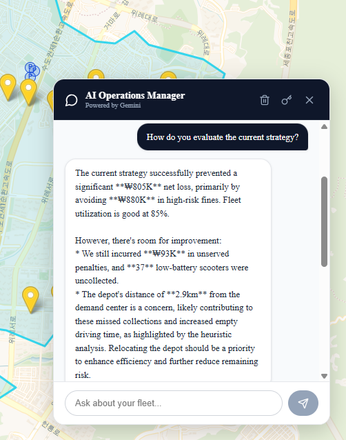

# ResilientFleet: Micromobility Decision Support System 🛴

> **KAIST IE437 Data-Driven Decision Making & Control - Final Project**
>
> A React-based decision support system designed to minimize operational losses for e-scooter fleets in the Greater Gangnam area (Seoul).


## 📸 Screenshots
| Operational Dashboard | AI Consultant |
|:---:|:---:|
|  |  |

## 📖 Project Overview
Unlike traditional VRP solvers that focus on revenue, **ResilientFleet** addresses the critical **"Loss Prevention"** challenge in micromobility:
1.  **Regulatory Fines:** Managing high-risk scooters near subway stations (₩40,000 fine/unit).
2.  **Dead Inventory:** Recovering low-battery scooters (<20%) to prevent revenue loss.

The system solves a **Team Orienteering Problem (TOP)**, integrating Generative AI for strategic insights.

## ✨ Key Features

### 1. Stochastic Scenario Generation (Anchor-Based)
- Simulates realistic scooter distribution in **Gangnam 3-gu**.
- Generate "High-Risk" nodes near subway exits and bus stops using OpenStreetMap data.

### 2. "Loss Prevention" Optimization Engine
- **Engine:** Omelet VRP API (Solver) + iNavi Maps API (Distance Matrix).
- **Logic:** Transforms the problem into a Prize-Collecting VRP where penalties (fines) act as rewards for collection.

### 3. Generative AI Operations Assistant 🤖
- **Powered by:** Google Gemini 2.0 Flash.
- **Function:** An interactive chatbot that interprets raw simulation logs.
- **RAG-Lite:** Injects real-time metrics (Net Loss Prevented, Utilization Rate) into the system prompt for context-aware advice.

## 🛠️ Technology Stack
- **Frontend:** React 18, TypeScript, Vite, Tailwind CSS
- **Mapping:** Leaflet, React-Leaflet, OpenStreetMap (Overpass API)
- **Routing/VRP:** Omelet Optimization API, iNavi Route Matrix API
- **AI Integration:** Google Gemini API

## 🚀 Getting Started

### Prerequisites
- Node.js (v18+)
- API Keys for Omelet, iNavi, and Google Gemini

### Installation

1.  **Clone the repository**
    ```bash
    git clone [https://github.com/howon-c/Seoul-Micromobility-Optimizer.git](https://github.com/howon-c/Seoul-Micromobility-Optimizer.git)
    cd Seoul-Micromobility-Optimizer
    ```

2.  **Navigate to the Frontend Directory**
    The main application code is located in the `frontend` directory.
    ```bash
    cd frontend
    ```

3.  **Install Dependencies**
    Install all required Node/React packages (this includes Leaflet, Tailwind, etc.).
    ```bash
    npm install
    ```

4.  **Configure API Keys**
    Create a file named **`.env`** in the `frontend` directory and populate it with your API keys. The application uses these variables for routing and AI services.

    ```bash
    VITE_OMELET_API_KEY=your_key_here
    VITE_INAVI_API_KEY=your_key_here
    VITE_GEMINI_API_KEY=your_key_here
    ```

5.  **Run the Development Server**
    Start the Vite development server. The terminal will provide the link (usually `http://localhost:5173/`).
    ```bash
    npm run dev
    ```

6.  **Access the App**
    Open your browser to the local address provided by the terminal (e.g., `http://localhost:5173/`) to view the **ResilientFleet** dashboard.
